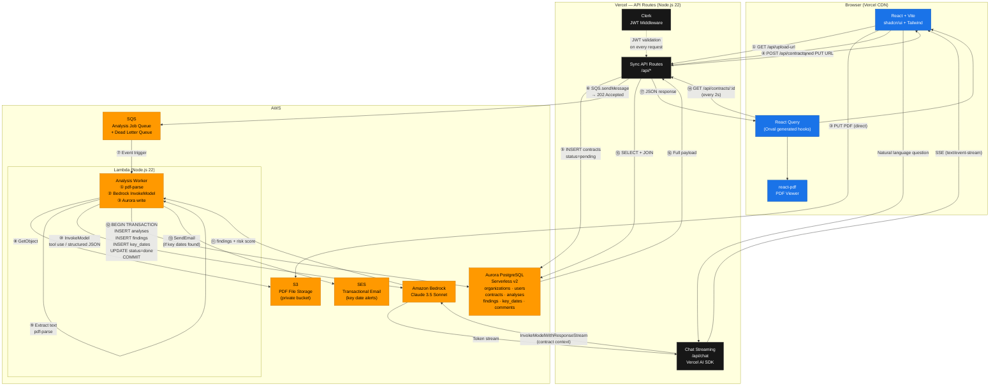
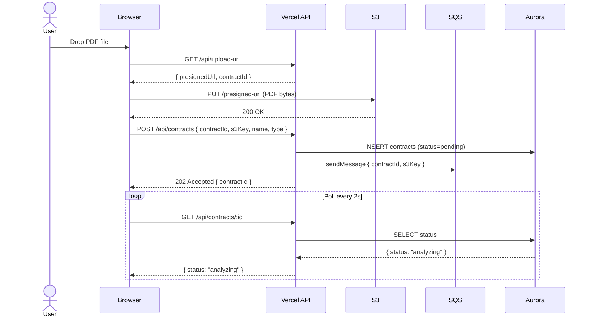
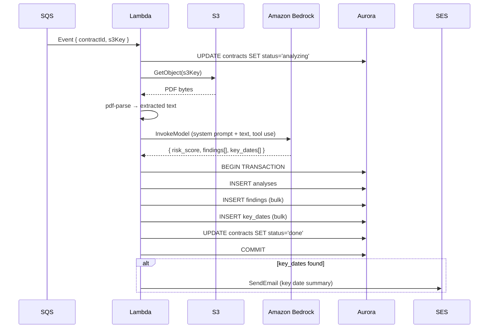

# ContractLens — Architecture Document

> **Version:** 1.1.0
> **Status:** Draft
> **Hackathon:** H01 (h01.devpost.com) — June 2026
> **Last Updated:** June 2026

---

## Table of Contents

1. [Overview](#1-overview)
2. [Architecture Style](#2-architecture-style)
3. [Architecture Patterns](#3-architecture-patterns)
4. [System Diagram](#4-system-diagram)
5. [Architecture Layers](#5-architecture-layers)
6. [Component Descriptions](#6-component-descriptions)
7. [Architecture Decision Records (ADRs)](#7-architecture-decision-records-adrs)
8. [Tech Stack](#8-tech-stack)
9. [Architecture Improvements](#9-architecture-improvements)
10. [Architecture Compliance](#10-architecture-compliance)

---

## 1. Overview

ContractLens is a multi-tenant SaaS application that processes PDF contracts through an AI analysis pipeline and presents structured findings to business users. The system is designed around two primary constraints:

- **Vercel** hosts the frontend and synchronous API layer (required by hackathon).
- **AWS Aurora PostgreSQL** is the primary data store (required by hackathon).

These constraints drive the core architectural decision: long-running AI analysis work (15–30s) cannot run inside Vercel's serverless functions, so it is offloaded to an **AWS Lambda worker triggered by SQS**, keeping Vercel thin and AWS responsible for durable async processing.

The result is a **hybrid cloud architecture** — Vercel for the user-facing layer, AWS for the data and compute layer — with a clean boundary between them.

---

## 2. Architecture Style

### Primary Style: Event-Driven + Serverless

ContractLens uses an **event-driven serverless** architecture. The upload of a contract produces an event (SQS message) that triggers an independent processing unit (Lambda). Neither the frontend nor the API layer waits for the analysis to complete — they react to state changes via polling.

### Secondary Style: Multi-Tier Web Application

The system follows a classic **three-tier** structure:
- **Presentation tier** — React SPA on Vercel CDN
- **Application tier** — Vercel API Routes (sync) + AWS Lambda (async)
- **Data tier** — AWS Aurora PostgreSQL + AWS S3

### Tenancy Model: Multi-Tenant (Shared Infrastructure)

All organizations share the same database, Lambda function, and S3 bucket. Tenant isolation is enforced at the application layer via `organization_id` scoping on every query. This is the standard SaaS model for early-stage products.

---

## 3. Architecture Patterns

| Pattern | Where Applied | Purpose |
|---|---|---|
| **Command Query Responsibility Segregation (CQRS)** | API layer | Write operations (upload, analyze) go through a different path than reads (dashboard, polling) |
| **Async Job Queue** | SQS → Lambda | Decouples the upload request from the long-running analysis job |
| **Polling** | Frontend → Vercel API | Frontend checks contract status every 2s until `done`; avoids WebSocket complexity |
| **Presigned URL** | Browser → S3 | Client uploads directly to S3 without routing through the application server |
| **Repository Pattern** | Drizzle ORM layer | Data access is abstracted behind typed query functions, not raw SQL in route handlers |
| **Structured Output / Tool Use** | Amazon Bedrock (Claude 3.5 Sonnet) | LLM is constrained to return a typed JSON schema via Claude's tool use feature, not free-form text |
| **Token Streaming** | Vercel AI SDK + `@ai-sdk/amazon-bedrock` | Chat responses stream token-by-token to the frontend via SSE |
| **Dead Letter Queue** | SQS DLQ | Failed analysis jobs are captured after 3 retries for inspection and replay |
| **Transactional Write** | Lambda → Aurora | All analysis results (analyses + findings + key_dates) are written in a single ACID transaction |

---

## 4. System Diagram

### 4.1 Full System Architecture

### 4.2 Upload Sequence

### 4.3 Analysis Pipeline Sequence

---

## 5. Architecture Layers

### Layer 1 — Presentation (Browser)

Runs entirely in the browser, served from Vercel's global CDN. Stateless — all state lives in React Query's cache, which is backed by the API.

| Component | Responsibility |
|---|---|
| React + Vite SPA | Page routing, component rendering, user interactions |
| shadcn/ui + Tailwind | Design system, accessible UI primitives |
| react-pdf (pdfjs-dist) | In-browser PDF rendering with programmatic scroll and highlight |
| React Query (Orval) | Server state management, polling, cache invalidation |
| Vercel AI SDK (client) | Streaming chat UI, SSE consumption |

### Layer 2 — Application / API (Vercel)

Thin, stateless API layer. Handles authentication, input validation, and orchestration. Does not perform heavy computation — delegates to the async layer for anything long-running.

| Component | Responsibility |
|---|---|
| Vercel API Routes | REST endpoints for CRUD, upload orchestration, polling |
| Clerk JWT Middleware | Validates every request; extracts `userId` and `organizationId` |
| Zod v4 | Request body and query parameter validation |
| Drizzle ORM | Type-safe database queries against Aurora |
| Vercel AI SDK (server) | Streaming chat completions via `/api/chat` |

### Layer 3 — Async Processing (AWS Lambda)

The heavy compute layer. Triggered by SQS, runs independently of the request lifecycle. Has a 15-minute timeout — sufficient for any contract analysis workload.

| Component | Responsibility |
|---|---|
| Lambda Analysis Worker | Orchestrates the full analysis pipeline |
| pdf-parse | Extracts plain text from PDF bytes |
| Amazon Bedrock client (`@aws-sdk/client-bedrock-runtime`) | Invokes Claude 3.5 Sonnet via `InvokeModel`; uses Lambda IAM role — no API key |
| Drizzle ORM | Writes analysis results to Aurora in a single transaction |
| AWS SES client | Sends key date alert emails |

### Layer 4 — Data (AWS)

Persistent storage layer. All data is owned by AWS services in the same account and region.

| Component | Responsibility |
|---|---|
| Aurora PostgreSQL (Serverless v2) | Primary relational store; all application data |
| S3 (private bucket) | Binary PDF file storage |
| SQS Standard Queue | Analysis job queue with DLQ |

### Layer 5 — Cross-Cutting Concerns

| Concern | Implementation |
|---|---|
| Authentication | Clerk (JWT issued to browser, validated on every API Route) |
| Tenant isolation | `organization_id` filter on every Aurora query |
| Observability | Vercel logs (API layer) + CloudWatch (Lambda + SQS + Aurora) |
| Security | IAM least-privilege for Lambda; S3 presigned URLs expire in 5 min; HTTPS everywhere |
| Email delivery | AWS SES (same account, no extra vendor) |

---

## 6. Component Descriptions

### 6.1 Vercel API Routes (`/api/*`)

Thin REST handlers built on Next.js API Routes (or Vercel's native routing). Each route:
1. Validates the Clerk JWT via middleware
2. Parses and validates the request with Zod
3. Executes a Drizzle query or triggers an AWS action
4. Returns a typed JSON response

Routes are stateless and horizontally scalable. They do not perform LLM calls — that responsibility belongs to Lambda.

**Key routes:**
- `POST /api/upload-url` — generates a presigned S3 PUT URL
- `POST /api/contracts` — creates the contract record and enqueues the SQS job
- `GET /api/contracts/:id` — polling endpoint; returns current status and analysis when done
- `POST /api/chat` — streams a Claude 3.5 Sonnet response via Bedrock using the Vercel AI SDK

### 6.2 AWS Lambda — Analysis Worker

A single Lambda function triggered by SQS events. It is the only component that calls Amazon Bedrock for analysis (not chat). Its execution is:

1. Receive SQS message `{ contractId, s3Key }`
2. Update contract status to `analyzing`
3. Fetch PDF from S3
4. Extract text with `pdf-parse`
5. Chunk text if > 100k tokens
6. Call Amazon Bedrock (`InvokeModel`) with Claude 3.5 Sonnet and the structured analysis prompt using Claude's **tool use** feature to enforce a typed JSON response
7. Parse and validate the JSON response with Zod
8. Write all results to Aurora in a single transaction
9. Update contract status to `done`
10. Send SES email if key dates were found

Authentication to Bedrock uses the Lambda's **IAM execution role** — no API key is required. The role is granted `bedrock:InvokeModel` scoped to the Claude 3.5 Sonnet model ARN.

On any unhandled error, the contract status is set to `error` and the SQS message is retried up to 3 times before landing in the DLQ.

### 6.3 AWS SQS Queue

A Standard Queue (not FIFO — ordering is not required for analysis jobs). Configuration:
- **Visibility timeout:** 5 minutes (matches Lambda max expected duration)
- **Message retention:** 4 days
- **Max receive count:** 3 (before DLQ)
- **Dead Letter Queue:** captures failed jobs for inspection and manual replay

### 6.4 AWS Aurora PostgreSQL (Serverless v2)

The primary data store. Serverless v2 auto-scales from 0.5 ACU (idle) to 16 ACU (peak) without manual provisioning. Key design choices:

- **JSONB column** on `analyses.raw_llm_output` stores the full LLM response for debugging and re-processing without schema changes
- **Full-text search** on `findings.explanation` and `findings.excerpt` using `tsvector`/`tsquery` for the dashboard search feature
- **Row-level `organization_id` filtering** enforces tenant isolation at the query level
- **Foreign key constraints** with `ON DELETE CASCADE` ensure referential integrity when contracts are deleted

### 6.5 AWS S3 — PDF Storage

A private S3 bucket. No public access. PDFs are accessed via:
- **Presigned PUT URLs** (5-minute TTL) for browser uploads
- **IAM role** for Lambda reads (`s3:GetObject` only, scoped to the bucket)

File naming convention: `{organizationId}/{contractId}/{filename}.pdf`

### 6.6 Clerk — Authentication

Handles user registration, login (email/password + OAuth), session management, and multi-tenant organization support. The Clerk JWT contains `userId` and `organizationId` claims, which are extracted by the API middleware on every request.

### 6.7 Vercel AI SDK — Chat Streaming

The `/api/chat` route uses the Vercel AI SDK's `streamText` function with the `@ai-sdk/amazon-bedrock` provider to stream Claude 3.5 Sonnet responses to the browser via SSE (`text/event-stream`). The Vercel API Route authenticates to Bedrock using AWS credentials stored as environment variables (`AWS_ACCESS_KEY_ID`, `AWS_SECRET_ACCESS_KEY`, `AWS_REGION`). The contract's extracted text is injected as context in the system prompt, scoped to the authenticated user's organization.

### 6.8 AWS SES — Email Alerts

Sends transactional emails when key dates are extracted from a contract. Lambda calls `SES.sendEmail` directly after a successful analysis write. Email templates are plain HTML with the key date label, date, and a link back to the contract in the app.

---

## 7. Architecture Decision Records (ADRs)

### ADR-001 — Use S3 Presigned URLs for PDF Upload

**Status:** Accepted

**Context:** Vercel serverless functions have a 4.5 MB request body limit. Contract PDFs can be 10–50 MB. Routing uploads through Vercel would require chunking or a separate upload service.

**Decision:** Generate a presigned S3 PUT URL in a Vercel API Route and have the browser upload directly to S3. The Vercel function only handles the URL generation (< 100ms) and the subsequent metadata POST.

**Consequences:**
- No file size constraints from Vercel
- Upload bandwidth goes directly to S3, not through Vercel's infrastructure
- Presigned URLs must have a short TTL (5 min) to limit exposure
- Browser must handle the two-step flow (get URL → PUT to S3 → POST metadata)

---

### ADR-002 — Use SQS + Lambda for Async Analysis

**Status:** Accepted

**Context:** Claude 3.5 Sonnet analysis of a 30-page contract via Amazon Bedrock takes 15–30 seconds. Vercel API Routes have a maximum execution time of 60 seconds (Pro plan) or 10 seconds (Hobby). Running the analysis synchronously in a Vercel function is fragile and blocks the request.

**Decision:** Decouple the upload from the analysis using SQS as a job queue and Lambda as the worker. The Vercel API Route enqueues the job and returns 202 immediately. Lambda processes the job asynchronously.

**Consequences:**
- Lambda has a 15-minute timeout — sufficient for any contract size
- SQS provides durable delivery with automatic retry and DLQ
- Frontend must poll for completion (see ADR-003)
- Adds operational complexity: two compute environments to deploy and monitor

---

### ADR-003 — Use Polling Instead of WebSockets for Analysis Progress

**Status:** Accepted

**Context:** After enqueuing an analysis job, the frontend needs to know when it completes. Options: WebSocket, Server-Sent Events (SSE), or polling.

**Decision:** Use polling (`GET /api/contracts/:id` every 2 seconds) until `status === 'done'`.

**Consequences:**
- Simplest implementation — no persistent connection infrastructure
- Vercel API Routes are stateless and work naturally with polling
- 2s polling interval produces acceptable UX for a 15–30s analysis
- Slightly higher API call volume than push-based alternatives (negligible at hackathon scale)
- WebSocket or SSE can replace polling post-hackathon if needed

---

### ADR-004 — Use AWS SES Instead of a Third-Party Email Provider

**Status:** Accepted

**Context:** The system needs to send key date alert emails. Options include Resend, SendGrid, Postmark, or AWS SES.

**Decision:** Use AWS SES. The application already has AWS credentials for Aurora, S3, SQS, and Lambda. SES is in the same account and region.

**Consequences:**
- No additional vendor, credentials, or billing account
- SES pricing is near-zero for transactional volume at this scale
- SES requires domain verification and may require sandbox exit for production
- Less developer-friendly API than Resend, but sufficient for simple transactional emails

---

### ADR-005 — Use Aurora PostgreSQL Over DynamoDB

**Status:** Accepted

**Context:** The hackathon requires an AWS database. Options: Aurora PostgreSQL, Aurora DSQL, or DynamoDB.

**Decision:** Aurora PostgreSQL (Serverless v2).

**Rationale:**
- Contract data is deeply relational: analyses belong to contracts, findings belong to analyses, comments belong to findings. JOINs are natural and efficient.
- JSONB support allows storing the raw LLM output without a fixed schema.
- Full-text search (`tsvector`) handles dashboard search without an external search service.
- ACID transactions ensure the multi-step analysis write is atomic.
- Serverless v2 auto-scales from 0.5 ACU, keeping costs low during idle periods.

**Consequences:**
- Requires a VPC or Data API for Lambda connectivity (Data API chosen for simplicity)
- Cold start latency on Aurora Serverless v2 is ~1–2s after idle periods
- More operational overhead than DynamoDB for schema migrations

---

### ADR-006 — Use Drizzle ORM in Both Vercel and Lambda

**Status:** Accepted

**Context:** The application has two compute environments (Vercel API Routes and Lambda) that both need to query Aurora. Using different data access patterns in each would increase maintenance burden.

**Decision:** Use Drizzle ORM in both environments. Drizzle is Edge-compatible (works in Vercel's Node.js runtime) and lightweight enough for Lambda cold starts.

**Consequences:**
- Single schema definition shared across both environments
- Type-safe queries in both Vercel and Lambda
- Migrations run from a dedicated script, not from Lambda
- Drizzle's bundle size is small enough to not meaningfully impact Lambda cold start time

---

### ADR-007 — Use Vercel AI SDK for Chat Streaming

**Status:** Accepted

**Context:** The "Chat with the contract" feature requires streaming LLM responses to the browser. Options: raw Bedrock streaming, Vercel AI SDK with `@ai-sdk/amazon-bedrock`, or a custom SSE implementation.

**Decision:** Use the Vercel AI SDK's `streamText` function with the `@ai-sdk/amazon-bedrock` provider on the server and `useChat` hook on the client.

**Consequences:**
- Native integration with Vercel's serverless runtime
- Handles SSE protocol, backpressure, and error handling automatically
- `useChat` hook manages message history and streaming state on the client
- Consistent model provider (Bedrock / Claude) for both analysis and chat
- Ties the chat feature to the Vercel AI SDK's abstraction layer (acceptable tradeoff)

---

### ADR-008 — Use Amazon Bedrock with Claude 3.5 Sonnet as the LLM Provider

**Status:** Accepted

**Context:** The system requires an LLM for two tasks: (1) async contract analysis in Lambda, and (2) streaming chat in Vercel API Routes. The original design used OpenAI GPT-4o, which requires an external API key and introduces a third-party vendor outside the AWS ecosystem.

**Decision:** Replace OpenAI GPT-4o with **Anthropic Claude 3.5 Sonnet accessed via Amazon Bedrock**.

**Rationale:**
- **No external API key for Lambda** — Lambda authenticates to Bedrock using its IAM execution role (`bedrock:InvokeModel`). This eliminates a secret from the Lambda environment and keeps all compute-to-AI calls within AWS's private network.
- **Fully AWS-native** — Bedrock is an AWS managed service in the same account and region as Aurora, S3, SQS, and SES. No cross-cloud traffic, no separate billing account, no additional vendor relationship.
- **Claude's tool use for structured output** — Claude 3.5 Sonnet's tool use feature enforces a typed JSON schema response, equivalent to OpenAI's function calling. Zod validates the output before writing to Aurora.
- **Claude 3.5 Sonnet quality** — Claude 3.5 Sonnet matches or exceeds GPT-4o on long-document comprehension and instruction following, which are the primary requirements for contract analysis.
- **Vercel AI SDK support** — `@ai-sdk/amazon-bedrock` is an official provider in the Vercel AI SDK, so the chat streaming implementation requires only a provider swap — no architectural change.

**Consequences:**
- Lambda IAM role requires `bedrock:InvokeModel` permission scoped to the Claude 3.5 Sonnet model ARN
- Bedrock must be enabled in the target AWS region (model access requested in the Bedrock console)
- Vercel API Routes for chat require `AWS_ACCESS_KEY_ID`, `AWS_SECRET_ACCESS_KEY`, and `AWS_REGION` environment variables (Vercel cannot use IAM roles directly)
- Claude's tool use syntax differs slightly from OpenAI function calling — prompt and schema definition must use Anthropic's format
- No OpenAI API key needed anywhere in the system

---

## 8. Tech Stack

| Layer | Technology | Version | Role |
|---|---|---|---|
| Frontend framework | React | 19 | UI rendering |
| Build tool | Vite | 6 | Dev server, bundling |
| Language | TypeScript | 5 | Type safety across frontend and backend |
| UI components | shadcn/ui | latest | Accessible, unstyled component primitives |
| Styling | Tailwind CSS | 4 | Utility-first CSS |
| PDF viewer | react-pdf (pdfjs-dist) | 9 | In-browser PDF rendering + highlight |
| Animation | Framer Motion | 11 | Risk Score gauge animation |
| Server state | React Query (TanStack) | 5 | Polling, caching, server state |
| API codegen | Orval | 7 | OpenAPI → typed React Query hooks |
| Backend runtime | Node.js | 22 | Vercel API Routes + Lambda |
| API framework | Vercel API Routes | — | Sync REST endpoints |
| ORM | Drizzle ORM | 0.41 | Type-safe Aurora queries |
| Validation | Zod | 4 | Runtime schema validation |
| Auth | Clerk | 6 | JWT, multi-tenant orgs, OAuth |
| AI SDK | Vercel AI SDK + `@ai-sdk/amazon-bedrock` | 4 | Chat streaming via Bedrock |
| LLM | Anthropic Claude 3.5 Sonnet (Amazon Bedrock) | — | Contract analysis + chat; IAM role auth in Lambda |
| PDF parsing | pdf-parse | 1 | Server-side text extraction |
| Database | AWS Aurora PostgreSQL | Serverless v2 | Primary data store |
| File storage | AWS S3 | — | PDF binary storage |
| Job queue | AWS SQS | Standard | Async analysis jobs |
| Compute (async) | AWS Lambda | Node.js 22 | Analysis worker |
| Email | AWS SES | v2 | Transactional alerts |
| Frontend deploy | Vercel | — | CDN, CI/CD, preview deployments |

---

## 9. Architecture Improvements

These are not in scope for the MVP but represent the natural evolution of the architecture.

### Near-term

| Improvement | Description | Trigger |
|---|---|---|
| **Replace polling with SSE push** | Lambda publishes a completion event to an API Gateway WebSocket or Vercel KV pub/sub; frontend receives a push instead of polling | When analysis volume grows and polling overhead becomes measurable |
| **Aurora Data API → VPC + connection pooling** | Move Lambda into a VPC with RDS Proxy for connection pooling; reduces cold start latency and connection exhaustion under load | When concurrent Lambda invocations exceed ~50 |
| **AWS Textract for scanned PDFs** | Replace pdf-parse with Textract for image-based PDFs; adds OCR capability | When scanned PDF support becomes a user request |
| **CloudFront in front of S3** | Serve PDFs via CloudFront for faster delivery and signed URL support | When PDF load time becomes a UX concern |

### Medium-term

| Improvement | Description | Trigger |
|---|---|---|
| **Step Functions for analysis pipeline** | Replace the single Lambda function with an AWS Step Functions state machine: extract → chunk → analyze → write → notify | When the pipeline needs branching logic (e.g., OCR path vs text path) |
| **OpenSearch for full-text search** | Replace Aurora full-text search with Amazon OpenSearch for richer clause search across all contracts | When search latency or relevance becomes a product requirement |
| **Multi-region deployment** | Deploy Aurora Global Database + Lambda in a second region for EU data residency | When enterprise customers require data residency compliance |
| **Separate read replicas** | Add Aurora read replicas for dashboard and reporting queries to offload the primary instance | When read query volume impacts write performance |

### Long-term

| Improvement | Description | Trigger |
|---|---|---|
| **Event sourcing for contract history** | Replace status updates with an immutable event log (EventBridge + DynamoDB) for full audit trail | When compliance requirements demand immutable audit logs |
| **Fine-tuned model** | Fine-tune a smaller model on contract analysis data to reduce cost and latency vs Claude 3.5 Sonnet; deploy via Bedrock Custom Models | When analysis volume makes Bedrock costs significant |
| **Dedicated tenant databases** | Move enterprise customers to isolated Aurora clusters for stronger data isolation | When enterprise contracts require dedicated infrastructure |

---

## 10. Architecture Compliance

### Hackathon Requirements

| Requirement | Status | Evidence |
|---|---|---|
| AWS Aurora PostgreSQL as database | ✅ Compliant | Primary data store; all application data persisted in Aurora |
| Vercel for frontend deployment | ✅ Compliant | React SPA deployed to Vercel; API Routes on Vercel |

### Security Compliance

| Control | Status | Implementation |
|---|---|---|
| Authentication on all API endpoints | ✅ | Clerk JWT middleware on every Vercel API Route |
| Tenant data isolation | ✅ | `organization_id` filter on every Aurora query |
| Encrypted data at rest | ✅ | Aurora encryption enabled; S3 SSE-S3 |
| Encrypted data in transit | ✅ | HTTPS on Vercel; TLS on Aurora; HTTPS on S3 |
| Least-privilege IAM | ✅ | Lambda role: `s3:GetObject`, `sqs:ReceiveMessage`, `ses:SendEmail`, `bedrock:InvokeModel` (scoped to Claude model ARN), Aurora Data API only |
| Short-lived credentials for upload | ✅ | S3 presigned URLs expire in 5 minutes |
| No secrets in code | ✅ | All credentials in environment variables; Lambda→Bedrock uses IAM role (no API key) |

### Reliability Compliance

| Control | Status | Implementation |
|---|---|---|
| Durable job delivery | ✅ | SQS Standard Queue with 4-day retention |
| Automatic retry on failure | ✅ | SQS max receive count = 3; Lambda retry policy |
| Failed job capture | ✅ | SQS Dead Letter Queue |
| Atomic multi-table writes | ✅ | Single Aurora transaction for analysis results |
| Consistent contract status | ✅ | Status only set to `done` after successful COMMIT |

### Performance Compliance

| Metric | Target | Architecture Support |
|---|---|---|
| Upload flow (presigned URL + S3 PUT) | < 3s | Direct browser → S3; no Vercel proxy |
| Analysis end-to-end | < 30s | Lambda async; no Vercel timeout risk |
| Dashboard load | < 1.5s | Indexed Aurora queries; Vercel CDN for static assets |
| Chat first token | < 1s | Vercel AI SDK streaming; Bedrock Claude low latency |
| Database auto-scaling | 0.5–16 ACU | Aurora Serverless v2 |

### Accessibility Compliance

| Standard | Status | Notes |
|---|---|---|
| WCAG 2.1 AA contrast | Targeted | shadcn/ui components meet AA by default |
| Keyboard navigation | Targeted | All shadcn/ui primitives are keyboard accessible |
| Risk level not color-only | ✅ | Risk level shown as text label + color badge |
| Full validation | Requires manual testing | Automated checks cover contrast; screen reader testing is manual |

---

*ContractLens ARCHITECTURE v1.1.0 — H01 Hackathon (h01.devpost.com) — June 2026*
