# ContractLens — Detailed Product Document

> **Hackathon:** H01 (h01.devpost.com)
> **Track:** Monetizable B2B App
> **Type:** SaaS Web Application
> **Version:** 1.2.0
> **Date:** June 2026

---

## 1. Executive Summary

**ContractLens** is a SaaS web application that allows small and medium-sized businesses to upload contracts in PDF format and receive an intelligent analysis in seconds: identification of risky clauses, comparison against industry standards, an executive summary, and actionable recommendations — all without needing an in-house lawyer.

> **Problem:** 78% of SMBs sign contracts without proper legal review, exposing themselves to abusive clauses, hidden penalties, and unreasonable commitments. Hiring an external lawyer costs $200–$500 per contract and takes days.
>
> **Solution:** Instant, accessible, and affordable basic legal analysis for any company.

---

## 2. Value Proposition

| For whom | The problem | ContractLens offers |
|---|---|---|
| SMBs without in-house legal | Sign contracts without fully understanding them | Risk analysis in seconds |
| Entrepreneurs / Freelancers | Cannot afford legal advisory fees | Affordable basic review |
| Procurement / Sales teams | Complex vendor contracts | Benchmarking against industry standards |
| Growing startups | Many contracts, little time | Centralization and full traceability |

---

## 3. Core Features (MVP)

### 3.1 AI Contract Analysis

- **PDF Upload** — drag and drop or file picker.
- **Text extraction** — PDF parsing with structure detection.
- **AI Analysis** — using LLM (Anthropic Claude 3.5 Sonnet via Amazon Bedrock) to identify:
  - Limited or unlimited liability clauses.
  - Breach penalties.
  - Exclusivity or non-compete clauses.
  - Contract termination conditions.
  - Payment timelines and commercial terms.
  - Governing law and jurisdiction.
  - Auto-renewal and exit conditions.
- **Overall risk level** — Low / Medium / High / Critical (color-coded with a 0–100 score).
- **Executive summary** — plain-language paragraph explaining the contract.
- **Recommendations** — prioritized list of points to negotiate or reject.

### 3.2 Contracts Dashboard

- List view of all analyzed contracts.
- Filters by: date, contract type, risk level, tag.
- Search by name, company, or clause.
- Summary stats: total contracts, risk distribution, contracts expiring soon.

### 3.3 Analysis Detail View

- Integrated PDF viewer with overlaid annotations.
- Side panel with findings organized by category.
- Each finding includes: contract excerpt, explanation, risk level, and suggestion.
- Ability to mark findings as "reviewed" or "accepted".
- Export analysis report as PDF.

### 3.4 Standards Comparison

- Database of standard clauses by contract type (NDA, SaaS, Vendor, Employment, Lease).
- For each identified clause, shows whether it falls within or outside typical market range.
- Badges: "Market Standard" / "Uncommon" / "Unusually Restrictive".

### 3.5 Version History

- Save multiple versions of the same contract (v1, v2 negotiated, etc.).
- Compare changes between versions with a visual diff.
- Notes and comments per version.

### 3.6 Alerts & Reminders

- Key dates automatically extracted: expiration, renewal, payment milestones.
- Email notifications with configurable advance notice (30 / 15 / 7 days).
- Calendar view showing all active milestones.

### 3.7 Teams & Collaboration

- Per-company workspaces with multiple users.
- Roles: Admin, Editor, Viewer.
- Comments on findings with @mentions.
- Activity log per contract.

---

## 4. Wow Features (Differentiators)

| Feature | Description | Jury impact |
|---|---|---|
| **Animated Risk Score** | Visual gauge that fills from 0 to 100 as the analysis loads | Best Design |
| **Dangerous clause highlight** | Hovering a finding scrolls the PDF and highlights the exact clause | Best Technical |
| **Chat with the contract** | Ask in plain language: "When does this contract expire?" | Most Original |
| **Industry benchmark** | Compare your contracts against your sector's standards | Most Impactful |
| **Negotiation mode** | Suggests alternative wording for problematic clauses | Most Original |

---

## 5. Technical Architecture

### 5.1 Stack

| Layer | Technology | Notes |
|---|---|---|
| **Frontend** | React + Vite + TypeScript | |
| **UI Components** | shadcn/ui + Tailwind CSS | |
| **PDF Viewer** | react-pdf (pdfjs-dist) | In-browser viewer with clause highlighting; lazy-loaded on detail route |
| **Backend (sync)** | Vercel API Routes (Node.js 22) | Auth, CRUD, upload trigger, SSE push, health check |
| **Backend (async)** | AWS Lambda (Node.js 22) | LLM analysis pipeline; idempotency check; SQS heartbeat |
| **Job Queue** | AWS SQS | Decouples upload from analysis; durable delivery; DLQ alarm |
| **Event Bus** | Vercel KV (Redis pub/sub) | Analysis completion events → SSE push (replaces 2s polling as primary mechanism) |
| **Database** | AWS Aurora PostgreSQL *(required)* | Primary data store |
| **ORM** | Drizzle ORM | Type-safe queries, schema migrations |
| **Validation** | Zod v4 | Runtime validation on API boundaries |
| **File Storage** | AWS S3 + presigned URLs | Direct browser → S3 upload, no Vercel proxy |
| **PDF CDN** | AWS CloudFront | Global PDF delivery; signed URLs; OAC in front of S3 |
| **AI / LLM** | Anthropic Claude 3.5 Sonnet via Amazon Bedrock | Structured JSON output via tool use; IAM role auth in Lambda |
| **PDF Parsing** | pdf-parse (runs in Lambda) | Text extraction; stored in `analyses.extracted_text` for chat |
| **Authentication** | Clerk | Multi-tenant org support built-in |
| **AWS Credentials (Vercel)** | OIDC federation (`AWS_ROLE_ARN`) | Short-lived STS credentials; no static key pair stored |
| **Email** | AWS SES | Key date alerts; same AWS account, no extra vendor |
| **Real-time / Chat** | Vercel AI SDK + `@ai-sdk/amazon-bedrock` | Streams Claude tokens to frontend during chat |
| **Error Tracking** | Sentry | Aggregated errors + source maps for Vercel API Routes and Lambda |
| **API Codegen** | Orval (OpenAPI → React Query) | Type-safe hooks generated from OpenAPI spec |
| **Frontend Deploy** | Vercel *(required)* | |

### 5.2 Architecture Diagram

```mermaid
graph TD
    subgraph Browser["Browser (Vercel CDN)"]
        UI["React + Vite\nshadcn/ui + Tailwind"]
        PDFViewer["react-pdf (lazy)\nPDF Viewer"]
        ReactQuery["React Query\n(Orval generated)"]
        SSEClient["EventSource\nSSE client"]
    end

    subgraph Vercel["Vercel (API Routes — Node.js 22)"]
        APIRoutes["API Routes\n/api/*\n(paginated)"]
        AIStream["AI SDK\n/api/chat\nVercel AI SDK"]
        StatusStream["SSE Push\n/api/contracts/:id/status-stream"]
        HealthEP["GET /api/health"]
        Clerk["Clerk\nAuth middleware"]
        OIDC["OIDC → AssumeRole\nShort-lived AWS creds"]
    end

    subgraph AWS["AWS"]
        CloudFront["CloudFront\nPDF CDN (signed URLs)"]
        S3["S3\nPDF Storage (private)"]
        SQS["SQS\nJob Queue + DLQ alarm"]
        VercelKV["Vercel KV\nRedis pub/sub"]

        subgraph Lambda["Lambda (Node.js 22)"]
            LambdaFn["Analysis Worker\n① idempotency check\n② pdf-parse → extracted_text\n③ Bedrock InvokeModel\n④ Aurora write\n⑤ publish completion"]
        end

        Aurora["Aurora PostgreSQL\norganizations · users\ncontracts · analyses\nfindings · key_dates\ncomments · usage · audit_logs"]
        SES["SES\nEmail Alerts"]
        Bedrock["Amazon Bedrock\nClaude 3.5 Sonnet"]
    end

    %% Upload flow
    UI -->|"1 · GET /api/upload-url"| APIRoutes
    APIRoutes -->|"2 · Presigned PUT URL"| UI
    UI -->|"3 · PUT PDF (direct)"| S3
    UI -->|"4 · POST /api/contracts\n(quota check)"| APIRoutes
    APIRoutes -->|"5 · INSERT contract\nINCREMENT usage"| Aurora
    APIRoutes -->|"6 · SQS.sendMessage"| SQS

    %% SSE subscription
    SSEClient -->|"7 · GET /status-stream"| StatusStream
    StatusStream -->|"8 · SUBSCRIBE contractId"| VercelKV

    %% Async analysis
    SQS -->|"9 · Trigger"| LambdaFn
    LambdaFn -->|"10 · GetObject"| S3
    LambdaFn -->|"11 · pdf-parse → extracted_text"| LambdaFn
    LambdaFn -->|"12 · InvokeModel (tool use)"| Bedrock
    Bedrock -->|"13 · findings + risk score"| LambdaFn
    LambdaFn -->|"14 · INSERT analyses+findings\nextracted_text · status=done"| Aurora
    LambdaFn -->|"15 · PUBLISH done"| VercelKV
    LambdaFn -->|"16 · SendEmail"| SES

    %% SSE push delivery
    VercelKV -->|"17 · event: done"| StatusStream
    StatusStream -->|"18 · SSE data: done"| SSEClient
    SSEClient --> UI

    %% Fallback polling (30s)
    ReactQuery -.->|"Fallback (30s)"| APIRoutes

    %% PDF via CloudFront
    PDFViewer -->|"Signed URL"| CloudFront
    CloudFront -->|"OAC"| S3

    %% Chat streaming
    UI -->|"Chat question"| AIStream
    AIStream -->|"InvokeModelWithResponseStream"| Bedrock
    Bedrock -->|"Token stream"| AIStream
    AIStream -->|"SSE stream"| UI

    %% Auth + OIDC
    Clerk -.->|"JWT validation"| APIRoutes
    OIDC -.->|"Short-lived creds"| APIRoutes

    classDef aws fill:#FF9900,color:#000,stroke:#c47400
    classDef vercel fill:#000,color:#fff,stroke:#333
    classDef browser fill:#1a73e8,color:#fff,stroke:#1557b0

    class CloudFront,S3,SQS,LambdaFn,Aurora,SES,Bedrock aws
    class APIRoutes,AIStream,StatusStream,HealthEP,Clerk,OIDC,VercelKV vercel
    class UI,PDFViewer,ReactQuery,SSEClient browser
```



### 5.3 Analysis Flow (step by step)

```
1.  Browser requests a presigned S3 PUT URL from Vercel API
2.  Browser uploads PDF directly to S3 (no Vercel proxy, no size limits)
3.  Browser opens SSE connection to GET /api/contracts/:id/status-stream
4.  Browser calls POST /api/contracts with { contractId, s3Key }
    → Vercel checks plan quota (HTTP 429 if over limit)
    → Vercel inserts contract record (status = pending) and increments usage counter
    → Vercel sends message to SQS (with correlationId) → returns 202 immediately
5.  AWS Lambda is triggered by SQS message
6.  Lambda performs idempotency check — exits if contract already done
7.  Lambda fetches PDF from S3
8.  Lambda extracts text with pdf-parse → stores as extracted_text
9.  Lambda calls Anthropic Claude 3.5 Sonnet via Amazon Bedrock with structured prompt (tool use) → receives findings JSON
10. Lambda writes analyses (+ extracted_text) + findings + key_dates to Aurora (single transaction) → status = done
11. Lambda publishes { contractId, status: 'done' } to Vercel KV pub/sub channel
12. Lambda calls AWS SES if key dates were extracted
13. Vercel KV delivers event → SSE stream pushes { status: 'done' } to browser in real time
    (If SSE connection dropped, browser falls back to 30-second polling)
14. React renders Risk Score gauge + findings panel + PDF viewer (lazy-loaded)
15. PDF is served via CloudFront (global CDN, signed URLs) — not directly from S3
16. Chat tab reads extracted_text from Aurora (no S3 re-fetch) and streams Q&A via Vercel AI SDK + `@ai-sdk/amazon-bedrock`
```

### 5.4 Key Architecture Decisions

| Decision | Rationale |
|---|---|
| **S3 presigned URLs for upload** | Bypasses Vercel's 4.5 MB body limit and avoids routing large PDFs through serverless functions |
| **SQS + Lambda for analysis** | LLM calls take 15–30s; Lambda has a 15-min timeout vs Vercel's 60s max. SQS provides durable retry on failure |
| **SSE push via Vercel KV** | Replaces 2s polling as primary completion signal; reduces Aurora Data API calls from O(N × duration/2) to O(1) per analysis; polling retained as 30s fallback |
| **OIDC federation for Vercel → AWS** | Eliminates long-lived `AWS_ACCESS_KEY_ID` / `AWS_SECRET_ACCESS_KEY` from Vercel environment; credentials rotate automatically via STS |
| **CloudFront in front of S3** | Global PDF delivery < 200ms TTFB; origin access control keeps S3 private; 1-hour cache TTL |
| **extracted_text in Aurora** | Chat endpoint reads pre-extracted text from Aurora instead of re-fetching PDF from S3 on every turn; reduces chat latency and S3 egress cost |
| **AWS SES instead of Resend** | Same AWS account as Aurora and S3 — no extra vendor, no extra credentials, near-zero cost |
| **Amazon Bedrock for LLM** | Claude 3.5 Sonnet accessed via Bedrock uses IAM role auth — no external API key, no extra vendor, stays fully within AWS |
| **Vercel AI SDK + `@ai-sdk/amazon-bedrock` for chat** | Native streaming support with Bedrock provider; works within Vercel's function model |
| **Drizzle ORM** | Type-safe, lightweight, works well in both Vercel (Edge-compatible) and Lambda environments |

### 5.5 Data Model (Aurora PostgreSQL)

```sql
-- Organizations (company workspace)
organizations
  id              UUID PK
  name            TEXT NOT NULL
  plan            TEXT DEFAULT 'free'   -- free | starter | pro
  created_at      TIMESTAMPTZ

-- Users
users
  id              UUID PK
  organization_id UUID FK → organizations
  email           TEXT UNIQUE
  name            TEXT
  role            TEXT   -- admin | editor | viewer
  created_at      TIMESTAMPTZ

-- Contracts
contracts
  id              UUID PK
  organization_id UUID FK → organizations
  uploaded_by     UUID FK → users
  name            TEXT NOT NULL
  counterparty    TEXT              -- name of the other party
  contract_type   TEXT              -- NDA | SaaS | Vendor | Employment | Other
  file_url        TEXT              -- S3 object URL
  file_name       TEXT
  file_size_bytes INT
  status          TEXT DEFAULT 'pending'  -- pending | analyzing | done | error
  created_at      TIMESTAMPTZ
  updated_at      TIMESTAMPTZ

-- Analyses (LLM output)
analyses
  id                    UUID PK
  contract_id           UUID FK → contracts
  version               INT DEFAULT 1
  risk_score            INT               -- 0-100
  risk_level            TEXT              -- low | medium | high | critical
  summary               TEXT              -- executive summary
  extracted_text        TEXT              -- plain-text from pdf-parse; used by /api/chat
  raw_llm_output        JSONB             -- raw LLM response (archived to S3 after 90 days)
  raw_llm_output_s3_key TEXT              -- S3 key once archived
  model_used            TEXT
  tokens_used           INT
  duration_ms           INT
  created_at            TIMESTAMPTZ

-- Individual findings
findings
  id              UUID PK
  analysis_id     UUID FK → analyses
  category        TEXT   -- liability | payment | termination | exclusivity | jurisdiction | renewal | other
  title           TEXT
  excerpt         TEXT   -- contract fragment
  explanation     TEXT   -- plain-language explanation
  risk_level      TEXT   -- low | medium | high | critical
  suggestion      TEXT   -- recommendation
  page_number     INT
  char_offset     INT    -- text position for highlight
  is_standard     BOOL   -- is this a market-standard clause?
  status          TEXT DEFAULT 'open'  -- open | reviewed | accepted
  created_at      TIMESTAMPTZ

-- Extracted key dates
key_dates
  id              UUID PK
  contract_id     UUID FK → contracts
  label           TEXT   -- "Expiration date", "Auto-renewal", etc.
  date            DATE
  notified_30d    BOOL DEFAULT false
  notified_7d     BOOL DEFAULT false
  created_at      TIMESTAMPTZ

-- Comments
comments
  id              UUID PK
  finding_id      UUID FK → findings
  user_id         UUID FK → users
  body            TEXT
  created_at      TIMESTAMPTZ

-- Monthly usage counters (plan quota enforcement)
organization_usage
  id                  UUID PK
  organization_id     UUID FK → organizations
  month               DATE             -- first day of billing month
  contracts_analyzed  INT DEFAULT 0
  UNIQUE (organization_id, month)

-- Audit log (compliance events)
audit_logs
  id              UUID PK
  organization_id UUID FK → organizations
  user_id         UUID FK → users
  event           TEXT        -- contract.viewed | contract.deleted | member.invited | member.removed
  resource_id     UUID
  resource_type   TEXT
  metadata        JSONB
  created_at      TIMESTAMPTZ
```

---

## 6. App Screens / Pages

### 6.1 Route Map

| Route | Screen | Description |
|---|---|---|
| `/` | Landing Page | Public marketing page |
| `/login` | Login | Authentication with Clerk |
| `/register` | Register | New organization onboarding |
| `/dashboard` | Dashboard | Overview of all contracts |
| `/contracts/new` | Upload | Upload a new contract |
| `/contracts/:id` | Detail | Full contract analysis view |
| `/contracts/:id/versions` | Versions | Version history and comparison |
| `/calendar` | Calendar | Key date milestones and alerts |
| `/settings` | Settings | Profile, team, plan, and billing |

### 6.2 Screen Descriptions

#### Landing Page (`/`)
- Hero with value proposition and CTA "Analyze your first contract for free".
- Animated demo showing the analysis flow.
- Key features section, pricing plans, testimonials, legal footer.

#### Dashboard (`/dashboard`)
- Stats cards: total contracts, high-risk contracts, contracts expiring in 30 days, analyses this month.
- Contracts table: Name, Counterparty, Type, Risk, Upload Date, Actions.
- Quick filters by risk and type. Prominent "New Analysis" button.

#### Upload (`/contracts/new`)
- Drag & drop area for PDF files (direct S3 upload via presigned URL).
- Optional fields: contract name, counterparty, contract type, tags.
- Progress bar with status messages ("Uploading...", "Queued for analysis...", "Analyzing clauses...").
- Polls contract status and redirects to detail view when `status = done`.

#### Analysis Detail (`/contracts/:id`)
- Split layout: PDF viewer (left) + findings panel (right).
- Header: contract name, type, counterparty, animated Risk Score gauge, analysis date.
- Tabs: Summary | Findings | Key Dates | Benchmark | Chat.
- Clicking a finding → PDF scrolls to and highlights the exact clause.

#### Calendar (`/calendar`)
- Monthly view with milestones color-coded by urgency.
- Side panel listing upcoming 30 days.
- Badge for contracts with auto-renewal within the next 30 days.

---

## 7. API Endpoints (OpenAPI)

```yaml
POST   /api/contracts                        # Create contract record + get presigned S3 URL
GET    /api/contracts                        # List organization's contracts
GET    /api/contracts/:id                    # Get contract with latest analysis (used for polling)
DELETE /api/contracts/:id                    # Delete contract

POST   /api/contracts/:id/analyze            # Re-analyze (enqueues new SQS job)
GET    /api/contracts/:id/analyses           # Analysis version history

PATCH  /api/findings/:id                     # Update finding status
POST   /api/findings/:id/comments            # Add comment
GET    /api/findings/:id/comments            # List comments

POST   /api/chat                             # Streaming chat against a contract (Vercel AI SDK)

GET    /api/key-dates                        # Key dates across all contracts
GET    /api/key-dates/upcoming               # Upcoming within the next N days

GET    /api/dashboard/stats                  # Summary stats
GET    /api/dashboard/risk-distribution      # Risk distribution (for chart)

GET    /api/organizations/me                 # Current organization data
PATCH  /api/organizations/me                 # Update organization settings
GET    /api/organizations/me/members         # List members
POST   /api/organizations/me/members         # Invite member
DELETE /api/organizations/me/members/:userId # Remove member
```

---

## 8. Analysis Prompt (AI)

```
You are a lawyer specializing in commercial contracts for businesses.
Analyze the following contract and return a JSON with:

{
  "risk_score": 0-100,
  "risk_level": "low|medium|high|critical",
  "summary": "Executive summary in 2-3 sentences",
  "contract_type": "NDA|SaaS|Vendor|Employment|Lease|Other",
  "findings": [
    {
      "category": "liability|payment|termination|exclusivity|jurisdiction|renewal|other",
      "title": "Short finding title",
      "excerpt": "Literal fragment from the contract",
      "explanation": "Plain-language explanation for a non-lawyer",
      "risk_level": "low|medium|high|critical",
      "suggestion": "What to do about it",
      "is_standard": true|false
    }
  ],
  "key_dates": [
    {
      "label": "Date name",
      "date": "YYYY-MM-DD or null if undeterminable",
      "context": "Clause from which it was extracted"
    }
  ],
  "negotiation_points": ["point 1", "point 2"]
}

Focus on: risk clauses for the signing company, not the counterparty.
Be conservative: when in doubt, flag as medium or high risk.
```

---

## 9. Monetization Model

| Feature | Free | Starter ($29/mo) | Pro ($79/mo) |
|---|---|---|---|
| Contracts / month | 3 | 20 | Unlimited |
| Versions per contract | 1 | 3 | Unlimited |
| Users | 1 | 5 | 15 |
| Chat with contract | ❌ | ✅ | ✅ |
| Negotiation mode | ❌ | ❌ | ✅ |
| Export PDF report | ❌ | ✅ | ✅ |
| Email alerts | ❌ | ✅ | ✅ |
| Support | — | Email | Priority |

---

## 10. Hackathon Criteria

| Criterion | How it's met |
|---|---|
| **Technical Implementation** | Aurora PostgreSQL + SQS + Lambda async pipeline, OpenAPI-first, PDF viewer with clause highlights |
| **Design** | Animated Risk Score gauge, PDF+analysis split view, risk-level color coding |
| **Impact** | Real problem with demonstrable ROI, clear business model, ready to monetize from day one |
| **Originality** | Chat with the contract (streaming), synchronized PDF↔finding highlight, negotiation mode |
| **Bonus** | Blog + demo video with #H0Hackathon (+0.6 pts) |

---

## 11. Development Plan (5 days)

### Day 1 — Infrastructure + Auth
- [ ] Create React + Vite project, deploy to Vercel
- [ ] Configure AWS Aurora PostgreSQL + Drizzle ORM schema
- [ ] Set up Clerk authentication + org middleware
- [ ] Create S3 bucket + presigned URL endpoint
- [ ] Create SQS queue + Lambda skeleton with SQS trigger

### Day 2 — Backend Core
- [ ] Presigned URL upload flow (browser → S3 → SQS)
- [ ] Lambda: pdf-parse text extraction
- [ ] Lambda: Anthropic Claude 3.5 Sonnet via Amazon Bedrock analysis prompt + structured output (tool use)
- [ ] Lambda: atomic Aurora write (analyses + findings + key_dates)
- [ ] Polling endpoint: GET /api/contracts/:id status

### Day 3 — Frontend Core
- [ ] General layout + navigation
- [ ] Upload page: drag & drop + presigned S3 upload + polling progress
- [ ] Dashboard: contract list + stats cards
- [ ] Detail view: PDF viewer (react-pdf) + findings panel

### Day 4 — Wow Features
- [ ] Animated Risk Score gauge (CSS + Framer Motion)
- [ ] Synchronized PDF ↔ finding highlight (char_offset → pdfjs viewport)
- [ ] Chat with the contract (Vercel AI SDK + `@ai-sdk/amazon-bedrock` streaming)
- [ ] Key dates calendar
- [ ] Export PDF report

### Day 5 — Polish + Deploy
- [ ] Negotiation mode (alternative clause wording)
- [ ] Team invitation system
- [ ] AWS SES email notifications for key dates
- [ ] Public landing page
- [ ] Production deploy: Vercel + Aurora + Lambda + SQS + SES
- [ ] Record demo video

---

## 12. Risks & Mitigations

| Risk | Probability | Impact | Mitigation |
|---|---|---|---|
| Scanned PDF (image, not text) | Medium | High | Warn the user; future AWS Textract integration |
| Slow LLM analysis (+30s) | Medium | Medium | Lambda handles up to 15 min; SQS heartbeat prevents re-queue |
| LLM hallucinations | Medium | High | Always show original excerpt; legal disclaimer |
| Token limit (long contracts) | Low | High | Chunk text by section before sending to LLM |
| SQS message loss | Very Low | High | SQS DLQ + Lambda retry policy + CloudWatch alarm |
| Duplicate analysis from SQS re-delivery | Very Low | Medium | Lambda idempotency check: exits if contract already `done` |
| Plan quota bypass | Low | High | Server-side quota enforcement on API Route + Lambda secondary guard |
| AWS credential leak (Vercel) | Very Low | Critical | OIDC federation — no long-lived key pair stored; credentials expire in 1 hour |
| Bedrock / Claude cost during demo | Low | Medium | Cache analyses; use pre-analyzed demo contracts |

---

## 13. Legal Disclaimer

> ContractLens is an AI-powered assistance tool designed to help identify potential areas of attention in contracts. **It does not constitute legal advice** and does not replace consultation with a qualified attorney. Analyses are indicative and may contain errors. Always consult a legal professional before signing important documents.

---

## 14. License

This project is licensed under the [MIT License](./LICENSE). 

---

*Generated for H01 Hackathon (h01.devpost.com) — June 2026*
