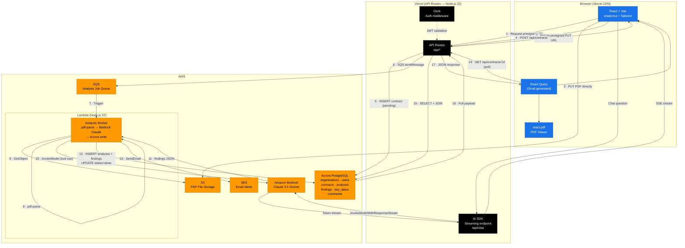

# ContractLens — Product Specification

> **Version:** 1.2.0
> **Status:** Draft
> **Hackathon:** H01 (h01.devpost.com) — June 2026
> **Track:** Monetizable B2B App

---

## Table of Contents

1. [Overview](#1-overview)
2. [Business Value](#2-business-value)
3. [Functional Requirements](#3-functional-requirements)
4. [Non-Functional Requirements](#4-non-functional-requirements)
5. [Tech Stack](#5-tech-stack)
6. [Architecture](#6-architecture)
7. [Data Model](#7-data-model)
8. [API Contract](#8-api-contract)
9. [Future Features](#9-future-features)
10. [Changelog](#10-changelog)
11. [Contributing](#11-contributing)
12. [License](#12-license)
13. [Conclusion](#13-conclusion)

---

## 1. Overview

**ContractLens** is a SaaS web application that enables small and medium-sized businesses to upload contracts in PDF format and receive an AI-powered analysis in seconds. The system identifies risky clauses, benchmarks them against industry standards, generates an executive summary, and provides actionable negotiation recommendations — without requiring in-house legal counsel.

### Problem Statement

78% of SMBs sign contracts without proper legal review, exposing themselves to abusive clauses, hidden penalties, and unreasonable commitments. Hiring an external lawyer costs $200–$500 per contract and takes days. The gap between "sign now" pressure and "understand fully" need is where ContractLens operates.

### Solution

An instant, accessible, and affordable contract analysis tool that gives any business the clarity of a legal review in under 30 seconds.

---

## 2. Business Value

### Target Users

| Segment | Pain Point | Value Delivered |
|---|---|---|
| SMBs without in-house legal | Sign contracts without fully understanding them | Risk analysis in seconds |
| Entrepreneurs / Freelancers | Cannot afford legal advisory fees | Affordable basic review |
| Procurement / Sales teams | Complex vendor contracts | Benchmarking against industry standards |
| Growing startups | Many contracts, little time | Centralization and full traceability |

### Monetization

| Feature | Free | Starter ($29/mo) | Pro ($79/mo) |
|---|---|---|---|
| Contracts / month | 3 | 20 | Unlimited |
| Versions per contract | 1 | 3 | Unlimited |
| Users | 1 | 5 | 15 |
| Chat with contract | ❌ | ✅ | ✅ |
| Negotiation mode | ❌ | ❌ | ✅ |
| Export PDF report | ❌ | ✅ | ✅ |
| Email alerts | ❌ | ✅ | ✅ |
| Support | — | Email | Priority |

### Revenue Projections (6 months post-launch)

| Scenario | Starter Users | Pro Users | MRR |
|---|---|---|---|
| Conservative | 50 | 10 | $2,240 |
| Base | 200 | 50 | $9,750 |
| Optimistic | 500 | 150 | $26,350 |

### ROI for Users

A single avoided bad clause (e.g., uncapped liability, missed auto-renewal) can save an SMB $10,000–$50,000. At $29/month, the payback period is effectively one avoided incident per year.

---

## 3. Functional Requirements

### FR-01 — Contract Upload

| ID | Requirement | Priority |
|---|---|---|
| FR-01.1 | Users can upload PDF contracts via drag & drop or file picker | Must Have |
| FR-01.2 | Upload goes directly from browser to S3 via presigned URL (no Vercel proxy) | Must Have |
| FR-01.3 | Maximum file size: 50 MB | Must Have |
| FR-01.4 | Only PDF format is accepted; other formats are rejected with a clear error | Must Have |
| FR-01.5 | Users can optionally provide: contract name, counterparty name, contract type, tags | Should Have |
| FR-01.6 | Upload progress is shown with a progress bar and status messages | Should Have |

### FR-02 — AI Analysis

| ID | Requirement | Priority |
|---|---|---|
| FR-02.1 | System extracts text from uploaded PDF server-side (Lambda) | Must Have |
| FR-02.2 | System sends extracted text to Anthropic Claude 3.5 Sonnet via Amazon Bedrock with a structured prompt (tool use) | Must Have |
| FR-02.3 | Analysis returns: risk score (0–100), risk level, executive summary, findings, key dates, negotiation points | Must Have |
| FR-02.4 | Analysis runs asynchronously; frontend polls for completion | Must Have |
| FR-02.5 | Contract status transitions: `pending → analyzing → done` (or `error`) | Must Have |
| FR-02.6 | On failure, contract is marked `error` and user is notified | Must Have |
| FR-02.7 | Long contracts (>100k tokens) are chunked by section before LLM submission | Should Have |
| FR-02.8 | Users can trigger a re-analysis to create a new version | Should Have |

### FR-03 — Analysis Display

| ID | Requirement | Priority |
|---|---|---|
| FR-03.1 | Risk Score is displayed as an animated gauge (0–100) with color coding | Must Have |
| FR-03.2 | Executive summary is shown in plain language | Must Have |
| FR-03.3 | Findings are listed by category with: excerpt, explanation, risk level, suggestion | Must Have |
| FR-03.4 | Clicking a finding scrolls the PDF viewer to the exact clause and highlights it | Must Have |
| FR-03.5 | Each finding can be marked as "reviewed" or "accepted" | Should Have |
| FR-03.6 | Analysis report can be exported as a PDF | Should Have |

### FR-04 — Standards Comparison

| ID | Requirement | Priority |
|---|---|---|
| FR-04.1 | Each finding is tagged with a market benchmark badge: "Market Standard" / "Uncommon" / "Unusually Restrictive" | Must Have |
| FR-04.2 | Benchmark data covers: NDA, SaaS, Vendor, Employment, Lease contract types | Should Have |

### FR-05 — Chat with Contract

| ID | Requirement | Priority |
|---|---|---|
| FR-05.1 | Users can ask plain-language questions about the contract | Must Have |
| FR-05.2 | Responses stream in real time via Vercel AI SDK + `@ai-sdk/amazon-bedrock` | Must Have |
| FR-05.3 | Responses cite the relevant clause from the contract | Should Have |
| FR-05.4 | Chat is available on Starter and Pro plans only | Must Have |

### FR-06 — Version History

| ID | Requirement | Priority |
|---|---|---|
| FR-06.1 | Multiple analysis versions can be saved per contract | Should Have |
| FR-06.2 | Users can compare changes between versions with a visual diff | Should Have |
| FR-06.3 | Each version supports notes and comments | Could Have |

### FR-07 — Key Dates & Alerts

| ID | Requirement | Priority |
|---|---|---|
| FR-07.1 | Key dates are automatically extracted from the contract (expiration, renewal, payment milestones) | Must Have |
| FR-07.2 | Email notifications are sent at configurable intervals: 30 / 15 / 7 days before each date | Should Have |
| FR-07.3 | A calendar view shows all active milestones across contracts | Should Have |
| FR-07.4 | Contracts with auto-renewal within 30 days are badged prominently | Should Have |

### FR-08 — Dashboard

| ID | Requirement | Priority |
|---|---|---|
| FR-08.1 | Dashboard shows: total contracts, high-risk count, expiring in 30 days, analyses this month | Must Have |
| FR-08.2 | Contracts table with columns: Name, Counterparty, Type, Risk, Upload Date, Actions | Must Have |
| FR-08.3 | Filters by: risk level, contract type, date range | Should Have |
| FR-08.4 | Full-text search by contract name, counterparty, or clause content | Should Have |

### FR-09 — Teams & Collaboration

| ID | Requirement | Priority |
|---|---|---|
| FR-09.1 | Each organization has an isolated workspace | Must Have |
| FR-09.2 | Roles: Admin, Editor, Viewer with appropriate permission scopes | Must Have |
| FR-09.3 | Admins can invite members by email | Should Have |
| FR-09.4 | Users can comment on findings with @mentions | Should Have |
| FR-09.5 | Activity log is maintained per contract | Could Have |

### FR-10 — Authentication & Multi-tenancy

| ID | Requirement | Priority |
|---|---|---|
| FR-10.1 | Authentication via Clerk (email/password + OAuth) | Must Have |
| FR-10.2 | Every data query is scoped to the user's organization | Must Have |
| FR-10.3 | New users are onboarded into a new organization by default | Must Have |
| FR-10.4 | Users can belong to only one organization (MVP) | Must Have |

### FR-11 — Negotiation Mode

| ID | Requirement | Priority |
|---|---|---|
| FR-11.1 | For high-risk findings, the system suggests alternative clause wording | Should Have |
| FR-11.2 | Negotiation mode is available on Pro plan only | Must Have |

---

## 4. Non-Functional Requirements

### NFR-01 — Performance

| ID | Requirement | Target |
|---|---|---|
| NFR-01.1 | PDF upload (presigned URL request + S3 PUT) | < 3s for files up to 10 MB |
| NFR-01.2 | Contract analysis end-to-end (SQS → Lambda → Aurora) | < 30s for contracts up to 30 pages |
| NFR-01.3 | Dashboard initial load (API + render) | < 1.5s |
| NFR-01.4 | Polling interval for analysis status (fallback only; see NFR-01.6) | Every 2s |
| NFR-01.5 | Chat first token latency (Vercel AI SDK + Bedrock streaming) | < 600ms |
| NFR-01.6 | Analysis completion is delivered to the browser via SSE push (`GET /api/contracts/:id/status-stream`); polling is a 30-second fallback only; each in-flight analysis consumes at most 1 Aurora query for the completion event (vs. O(duration/2) queries under pure polling) |
| NFR-01.7 | `GET /api/contracts` and all list endpoints support cursor-based pagination (`?limit=25&cursor=<token>`); default limit = 25, maximum = 100; unbounded list responses are rejected with HTTP 400 |
| NFR-01.8 | The `pdfjs-dist` worker bundle (~3 MB) is code-split into a dedicated chunk and lazy-loaded only when the contract detail route (`/contracts/:id`) is active; it is never loaded on the dashboard or landing page |
| NFR-01.9 | The Lambda analysis worker stores the extracted plain-text of each contract in `analyses.extracted_text`; the `/api/chat` route reads this column rather than re-fetching the PDF from S3 on every chat turn |
| NFR-01.10 | PDFs are served via a CloudFront distribution in front of S3 (signed URLs, OAC, 1-hour cache TTL); PDF first-byte latency < 200ms for users in the EU and APAC regions |

### NFR-02 — Scalability

| ID | Requirement |
|---|---|
| NFR-02.1 | Aurora PostgreSQL Serverless v2 auto-scales from 0.5 ACU to 16 ACU based on load |
| NFR-02.2 | Lambda concurrency scales automatically with SQS queue depth |
| NFR-02.3 | S3 provides effectively unlimited storage for PDF files |
| NFR-02.4 | Vercel Edge Network handles frontend CDN distribution globally |

### NFR-03 — Reliability

| ID | Requirement |
|---|---|
| NFR-03.1 | SQS dead-letter queue captures failed analysis jobs after 3 retries |
| NFR-03.2 | Lambda analysis writes to Aurora in a single ACID transaction; partial writes roll back |
| NFR-03.3 | Contract status is always consistent: a contract is never `done` without a complete analysis |
| NFR-03.4 | Vercel API Routes are stateless and horizontally scalable |
| NFR-03.5 | SQS visibility timeout is set to 17 minutes (Lambda max timeout 15 min + 2 min buffer); the Lambda worker also extends visibility via `ChangeMessageVisibility` heartbeats every 4 minutes during long-running analyses to prevent re-queuing |
| NFR-03.6 | The Lambda analysis worker performs an idempotency check at startup: if the target contract is already `done`, the function exits without invoking Bedrock, preventing duplicate analyses from SQS re-deliveries |
| NFR-03.7 | `GET /api/health` returns `{ "status": "ok", "db": "ok", "timestamp": "..." }` after executing `SELECT 1` against Aurora; returns HTTP 503 if Aurora is unreachable; the endpoint is monitored by an external uptime service at 30-second intervals |

### NFR-04 — Security

| ID | Requirement |
|---|---|
| NFR-04.1 | All API routes validate a Clerk JWT on every request |
| NFR-04.2 | Every database query filters by `organization_id` to enforce tenant isolation |
| NFR-04.3 | S3 presigned URLs expire after 5 minutes |
| NFR-04.4 | S3 bucket is private; no public access |
| NFR-04.5 | Lambda IAM role follows least-privilege: S3 read, SQS consume, Aurora write, SES send, Bedrock InvokeModel |
| NFR-04.6 | All secrets (DB credentials) are stored in environment variables; Bedrock access uses Lambda IAM role — no API key needed |
| NFR-04.7 | HTTPS enforced on all endpoints (Vercel + AWS API Gateway) |
| NFR-04.8 | Vercel API Routes authenticate to AWS using short-lived credentials via OIDC federation (GitHub Actions OIDC → IAM AssumeRole); no long-lived `AWS_ACCESS_KEY_ID` / `AWS_SECRET_ACCESS_KEY` stored as environment variables |
| NFR-04.9 | Every plan's monthly contract quota is enforced server-side: `POST /api/contracts` rejects with HTTP 429 if the organization's `contracts_analyzed_this_month` counter has reached the plan limit; the Lambda worker performs a secondary idempotency check before invoking Bedrock |
| NFR-04.10 | All Vercel API Route responses include a `Content-Security-Policy` header; the CSP `worker-src` and `script-src` directives permit the pdfjs worker path served from the Vercel CDN |
| NFR-04.11 | An immutable audit log records compliance-sensitive events per organization: contract viewed, contract deleted, member invited, member removed; log entries are append-only and scoped by `organization_id` |

### NFR-05 — Observability

| ID | Requirement |
|---|---|
| NFR-05.1 | Vercel built-in logs and error tracking for API Routes |
| NFR-05.2 | Lambda structured logs to CloudWatch with contract ID and duration |
| NFR-05.3 | Aurora slow query log enabled |
| NFR-05.4 | SQS CloudWatch metrics: queue depth, age of oldest message, DLQ count |
| NFR-05.5 | A `correlationId` (equal to `contractId`) is included as a structured field in every log line emitted by the Vercel API Route, SQS message attributes, and Lambda handler for a given analysis request; this enables end-to-end trace reconstruction using a single identifier |
| NFR-05.6 | A CloudWatch Alarm on SQS DLQ `NumberOfMessagesSent ≥ 1` triggers an SNS notification within 2 minutes of the first failed analysis job landing in the DLQ |
| NFR-05.7 | Application-level error tracking (Sentry or equivalent) is integrated in both the Vercel API layer and the Lambda worker; source maps are uploaded at build time; `contractId` and `organizationId` are attached as context tags to every error event |
| NFR-05.8 | SLOs are defined and monitored for the two critical user-facing operations: analysis pipeline success rate ≥ 99%, and analysis end-to-end p95 latency ≤ 45s; CloudWatch alarms alert when either SLO is breached |

### NFR-06 — Accessibility

| ID | Requirement |
|---|---|
| NFR-06.1 | UI meets WCAG 2.1 AA contrast ratios |
| NFR-06.2 | All interactive elements are keyboard navigable |
| NFR-06.3 | Risk level is communicated via both color and text label (not color alone) |

### NFR-07 — Legal & Compliance

| ID | Requirement |
|---|---|
| NFR-07.1 | Legal disclaimer displayed on every analysis result |
| NFR-07.2 | Contract PDFs are stored in S3 with server-side encryption (SSE-S3) |
| NFR-07.3 | Users can delete their contracts and all associated data |

---

## 5. Tech Stack

| Layer | Technology | Rationale |
|---|---|---|
| **Frontend** | React + Vite + TypeScript | Fast DX, strong typing, Vercel-native |
| **UI Components** | shadcn/ui + Tailwind CSS | Accessible, unstyled primitives with full design control |
| **PDF Viewer** | react-pdf (pdfjs-dist) | In-browser rendering with programmatic scroll + highlight |
| **Backend (sync)** | Vercel API Routes (Node.js 22) | Auth, CRUD, upload trigger, polling — short-lived operations |
| **Backend (async)** | AWS Lambda (Node.js 22) | LLM analysis pipeline — up to 15-min timeout, auto-scaling |
| **Job Queue** | AWS SQS | Durable async decoupling; built-in retry + DLQ |
| **Database** | AWS Aurora PostgreSQL (Serverless v2) | Relational integrity, JSONB, full-text search, auto-scaling |
| **ORM** | Drizzle ORM | Type-safe, lightweight, Edge-compatible |
| **Validation** | Zod v4 | Runtime schema validation on all API boundaries |
| **File Storage** | AWS S3 + presigned URLs | Direct browser upload, no Vercel body size limits |
| **AI / LLM** | Anthropic Claude 3.5 Sonnet via Amazon Bedrock | Fully AWS-native; IAM role auth, no external API key; tool use for structured JSON output |
| **PDF Parsing** | pdf-parse (Lambda) | Server-side text extraction |
| **Authentication** | Clerk | Multi-tenant org support, JWT middleware, OAuth |
| **Email** | AWS SES | Same AWS account — no extra vendor or credentials |
| **Real-time / Streaming** | Vercel AI SDK + `@ai-sdk/amazon-bedrock` | Native Claude streaming via Bedrock, works within Vercel's function model |
| **API Codegen** | Orval (OpenAPI → React Query) | Type-safe client hooks generated from spec |
| **Frontend Deploy** | Vercel | Required by hackathon; CDN, preview deployments, CI/CD |

---

## 6. Architecture

### System Diagram



### Key Architecture Decisions

| Decision | Rationale |
|---|---|
| **S3 presigned URLs** | Bypasses Vercel's 4.5 MB body limit; PDFs go directly browser → S3 |
| **SQS + Lambda** | LLM calls take 15–30s; Lambda supports up to 15 min vs Vercel's 60s max |
| **Polling over WebSocket** | Simpler on Vercel; 2s polling is acceptable for a 30s analysis |
| **Amazon Bedrock for LLM** | Claude 3.5 Sonnet accessed via Bedrock uses IAM role auth — no external API key, stays fully within AWS |
| **Vercel AI SDK** | Native streaming with `@ai-sdk/amazon-bedrock` provider; works within Vercel's serverless model |
| **Drizzle ORM** | Edge-compatible, type-safe, works in both Vercel and Lambda |

---

## 7. Data Model

```sql
-- Organizations (multi-tenant workspace)
organizations
  id              UUID PK
  name            TEXT NOT NULL
  plan            TEXT DEFAULT 'free'        -- free | starter | pro
  created_at      TIMESTAMPTZ

-- Users
users
  id              UUID PK
  organization_id UUID FK → organizations
  email           TEXT UNIQUE NOT NULL
  name            TEXT
  role            TEXT                       -- admin | editor | viewer
  created_at      TIMESTAMPTZ

-- Contracts
contracts
  id              UUID PK
  organization_id UUID FK → organizations
  uploaded_by     UUID FK → users
  name            TEXT NOT NULL
  counterparty    TEXT
  contract_type   TEXT                       -- NDA | SaaS | Vendor | Employment | Other
  file_url        TEXT                       -- S3 object URL
  file_name       TEXT
  file_size_bytes INT
  status          TEXT DEFAULT 'pending'     -- pending | analyzing | done | error
  created_at      TIMESTAMPTZ
  updated_at      TIMESTAMPTZ

-- Analyses (LLM output, versioned)
analyses
  id                  UUID PK
  contract_id         UUID FK → contracts
  version             INT DEFAULT 1
  risk_score          INT                        -- 0–100
  risk_level          TEXT                       -- low | medium | high | critical
  summary             TEXT
  extracted_text      TEXT                       -- plain-text extracted by pdf-parse; used by /api/chat to avoid re-fetching PDF from S3
  raw_llm_output      JSONB                      -- full LLM response (archived to S3 after 90 days; see raw_llm_output_s3_key)
  raw_llm_output_s3_key TEXT                     -- S3 key of gzip-archived LLM response once moved off Aurora
  model_used          TEXT
  tokens_used         INT
  duration_ms         INT
  created_at          TIMESTAMPTZ

-- Findings (individual clause findings)
findings
  id              UUID PK
  analysis_id     UUID FK → analyses
  category        TEXT   -- liability | payment | termination | exclusivity | jurisdiction | renewal | other
  title           TEXT
  excerpt         TEXT                       -- literal contract fragment
  explanation     TEXT                       -- plain-language explanation
  risk_level      TEXT                       -- low | medium | high | critical
  suggestion      TEXT
  page_number     INT
  char_offset     INT                        -- text position for PDF highlight
  is_standard     BOOL
  status          TEXT DEFAULT 'open'        -- open | reviewed | accepted
  created_at      TIMESTAMPTZ

-- Key dates (auto-extracted)
key_dates
  id              UUID PK
  contract_id     UUID FK → contracts
  label           TEXT                       -- "Expiration date", "Auto-renewal", etc.
  date            DATE
  notified_30d    BOOL DEFAULT false
  notified_7d     BOOL DEFAULT false
  created_at      TIMESTAMPTZ

-- Comments (team collaboration)
comments
  id              UUID PK
  finding_id      UUID FK → findings
  user_id         UUID FK → users
  body            TEXT
  created_at      TIMESTAMPTZ

-- Monthly usage counters (plan quota enforcement — NFR-04.9)
organization_usage
  id                          UUID PK
  organization_id             UUID FK → organizations
  month                       DATE                       -- first day of the billing month, e.g. 2026-06-01
  contracts_analyzed          INT DEFAULT 0
  created_at                  TIMESTAMPTZ
  UNIQUE (organization_id, month)

-- Audit log (compliance events — NFR-04.11)
audit_logs
  id              UUID PK
  organization_id UUID FK → organizations
  user_id         UUID FK → users
  event           TEXT        -- contract.viewed | contract.deleted | member.invited | member.removed
  resource_id     UUID                               -- ID of the affected contract, user, etc.
  resource_type   TEXT                               -- contract | user
  metadata        JSONB                              -- additional context (e.g. IP address, user agent)
  created_at      TIMESTAMPTZ
```

---

## 8. API Contract

```yaml
# System
GET    /api/health                           # Liveness + Aurora connectivity check (HTTP 200 or 503)

# Upload & Contracts
POST   /api/contracts                        # Create contract record + return presigned S3 URL
GET    /api/contracts                        # List organization's contracts (cursor-paginated)
GET    /api/contracts/:id                    # Get contract + latest analysis (fallback polling endpoint)
GET    /api/contracts/:id/status-stream      # SSE push stream; emits { status } when analysis completes
DELETE /api/contracts/:id                    # Delete contract and all associated data

# Analysis
POST   /api/contracts/:id/analyze            # Re-analyze (enqueues new SQS job)
GET    /api/contracts/:id/analyses           # List all analysis versions

# Findings
PATCH  /api/findings/:id                     # Update finding status (reviewed / accepted)
POST   /api/findings/:id/comments            # Add comment to a finding
GET    /api/findings/:id/comments            # List comments on a finding

# Chat (streaming)
POST   /api/chat                             # Stream LLM response for a contract question

# Key Dates
GET    /api/key-dates                        # All key dates for the organization
GET    /api/key-dates/upcoming               # Upcoming within the next N days

# Dashboard
GET    /api/dashboard/stats                  # Aggregate stats (total, high-risk, expiring)
GET    /api/dashboard/risk-distribution      # Risk level distribution for chart

# Organization & Team
GET    /api/organizations/me                 # Current organization
PATCH  /api/organizations/me                 # Update organization settings
GET    /api/organizations/me/members         # List members
POST   /api/organizations/me/members         # Invite member by email
DELETE /api/organizations/me/members/:userId # Remove member
```

All endpoints require a valid Clerk JWT in the `Authorization: Bearer <token>` header. All responses are `application/json`. The `/api/chat` endpoint returns `text/event-stream`.

---

## 9. Future Features

These are out of scope for the MVP but represent the natural product roadmap post-hackathon.

### Near-term (1–3 months)

| Feature | Description |
|---|---|
| **OCR for scanned PDFs** | Integrate AWS Textract to handle image-based PDFs, not just text-based ones |
| **Clause library** | User-curated library of approved/rejected clause templates for their organization |
| **Bulk upload** | Upload and analyze multiple contracts in a single batch operation |
| **Slack / Teams integration** | Push key date alerts and high-risk findings to team channels |
| **Webhook support** | Notify external systems when an analysis completes or a key date approaches |

### Medium-term (3–6 months)

| Feature | Description |
|---|---|
| **Contract templates** | Generate contract drafts from templates with AI-assisted clause selection |
| **Counterparty risk scoring** | Aggregate risk profile per counterparty across all contracts |
| **Audit trail** | Immutable log of all actions per contract for compliance purposes |
| **SSO / SAML** | Enterprise authentication for larger organizations |
| **API access** | Public REST API for programmatic contract submission and result retrieval |

### Long-term (6–12 months)

| Feature | Description |
|---|---|
| **Multi-language support** | Analyze contracts in Spanish, French, German, Portuguese |
| **Jurisdiction-aware analysis** | Tailor risk assessment to the governing law of the contract |
| **E-signature integration** | Connect with DocuSign / HelloSign to analyze before signing in one flow |
| **Legal network marketplace** | Connect users with vetted lawyers for contracts flagged as critical risk |
| **Mobile app** | iOS / Android app for reviewing contracts on the go |

---

## 10. Changelog

### v1.2.0 — June 2026 (Wave 0 + Wave 1 — Post-Hackathon Hardening)

**Security**
- NFR-04.8: Replaced long-lived `AWS_ACCESS_KEY_ID` / `AWS_SECRET_ACCESS_KEY` in Vercel with short-lived OIDC-federated credentials (GitHub Actions OIDC → IAM AssumeRole)
- NFR-04.9: Added server-side plan quota enforcement on `POST /api/contracts` with HTTP 429 and Lambda-side idempotency guard
- NFR-04.10: Added Content-Security-Policy headers covering pdfjs worker paths
- NFR-04.11: Added append-only audit log for compliance-sensitive events

**Observability**
- NFR-05.5: `correlationId` (= `contractId`) threaded through Vercel, SQS message attributes, and Lambda logs
- NFR-05.6: CloudWatch Alarm on SQS DLQ `NumberOfMessagesSent ≥ 1` with SNS notification
- NFR-05.7: Sentry error tracking integrated in Vercel API layer and Lambda worker
- NFR-05.8: SLOs defined: analysis success rate ≥ 99%, p95 latency ≤ 45s

**Performance & Cost**
- NFR-01.6: SSE push endpoint (`GET /api/contracts/:id/status-stream`) replaces polling as the primary analysis completion mechanism; polling retained as 30-second fallback
- NFR-01.7: Cursor-based pagination on all list endpoints (`?limit=25&cursor=<token>`)
- NFR-01.8: pdfjs-dist worker bundle lazy-loaded on contract detail route only
- NFR-01.9: Extracted contract text stored in `analyses.extracted_text`; `/api/chat` reads column instead of re-fetching S3
- NFR-01.10: CloudFront distribution added in front of S3 for global PDF delivery

**Reliability**
- NFR-03.5: SQS visibility timeout extended to 17 minutes; Lambda heartbeats via `ChangeMessageVisibility`
- NFR-03.6: Lambda idempotency check prevents duplicate analyses from SQS re-deliveries
- NFR-03.7: `GET /api/health` endpoint with Aurora connectivity check

**Data Model**
- `analyses`: added `extracted_text TEXT` and `raw_llm_output_s3_key TEXT` columns
- Added `organization_usage` table for monthly quota tracking
- Added `audit_logs` table for compliance event recording

**API**
- Added `GET /api/health`
- Added `GET /api/contracts/:id/status-stream` (SSE)
- `GET /api/contracts` now requires pagination parameters

**Environment Variables**
- Removed: `AWS_ACCESS_KEY_ID`, `AWS_SECRET_ACCESS_KEY`
- Added: `AWS_ROLE_ARN`, `CLOUDFRONT_DOMAIN`, `SENTRY_DSN`, `SENTRY_DSN_LAMBDA`

---

### v1.1.0 — June 2026

- Replaced OpenAI GPT-4o with Anthropic Claude 3.5 Sonnet via Amazon Bedrock
- Lambda analysis worker now authenticates to Bedrock via IAM role — no external API key
- Chat streaming updated to use `@ai-sdk/amazon-bedrock` provider with Vercel AI SDK
- Structured output migrated from OpenAI function calling to Claude tool use
- Removed `OPENAI_API_KEY` from required environment variables
- Added `bedrock:InvokeModel` to Lambda IAM execution role

### v1.0.0 — June 2026 (Hackathon MVP)

- Initial release for H01 Hackathon
- PDF upload via S3 presigned URLs
- Async AI analysis pipeline: SQS → Lambda → Anthropic Claude 3.5 Sonnet (Amazon Bedrock) → Aurora PostgreSQL
- Risk Score gauge (0–100) with animated display
- Findings panel with PDF clause highlighting
- Chat with the contract (Vercel AI SDK + `@ai-sdk/amazon-bedrock` streaming)
- Key dates extraction and calendar view
- Dashboard with stats and contract list
- Multi-tenant workspaces with Clerk authentication
- AWS SES email alerts for key dates
- Export analysis as PDF report

---

## 11. Contributing

This project was built for H01 Hackathon. Post-hackathon contributions are welcome.

### Getting Started

```bash
# Clone the repository
git clone https://github.com/<org>/contractlens.git
cd contractlens

# Install dependencies
npm install

# Copy environment variables
cp .env.example .env.local
# Fill in: CLERK_*, DATABASE_URL, AWS_*, S3_BUCKET

# Run database migrations
npm run db:migrate

# Start the development server
npm run dev
```

### Environment Variables

| Variable | Description |
|---|---|
| `CLERK_SECRET_KEY` | Clerk backend secret key |
| `NEXT_PUBLIC_CLERK_PUBLISHABLE_KEY` | Clerk frontend publishable key |
| `DATABASE_URL` | Aurora PostgreSQL connection string (writer endpoint) |
| `AWS_REGION` | AWS region (e.g., `us-east-1`) |
| `AWS_ROLE_ARN` | IAM role ARN assumed by Vercel API Routes via OIDC federation (replaces static key pair — see NFR-04.8) |
| `S3_BUCKET_NAME` | S3 bucket for PDF storage |
| `CLOUDFRONT_DOMAIN` | CloudFront distribution domain for PDF delivery (see NFR-01.10) |
| `SQS_QUEUE_URL` | SQS queue URL for analysis jobs |
| `SES_FROM_EMAIL` | Verified SES sender address |
| `BEDROCK_MODEL_ID` | Bedrock model ID (e.g., `anthropic.claude-3-5-sonnet-20241022-v2:0`) |
| `SENTRY_DSN` | Sentry DSN for error tracking in Vercel API Routes |
| `SENTRY_DSN_LAMBDA` | Sentry DSN for error tracking in the Lambda worker |

> **Notes:**
> - `AWS_ACCESS_KEY_ID` and `AWS_SECRET_ACCESS_KEY` are **removed** in v1.2.0. Vercel API Routes assume `AWS_ROLE_ARN` via OIDC at request time — no long-lived key pair is stored.
> - Lambda→Bedrock calls continue to use the Lambda IAM execution role (`bedrock:InvokeModel`). No API key is required.
> - Lambda environment variables (`AWS_REGION`, `S3_BUCKET_NAME`, `SQS_QUEUE_URL`, `SES_FROM_EMAIL`, `BEDROCK_MODEL_ID`, `SENTRY_DSN_LAMBDA`) are set in the Lambda function configuration, not in Vercel.

### Branch Strategy

- `main` — production-ready code, deployed to Vercel
- `dev` — integration branch for feature work
- `feature/<name>` — individual feature branches

### Pull Request Guidelines

- Keep PRs focused on a single feature or fix
- Include a description of what changed and why
- All API changes must update the OpenAPI spec
- Run `npm run lint` and `npm run typecheck` before opening a PR

---

## 12. License

MIT License

Copyright (c) 2026 ContractLens

Permission is hereby granted, free of charge, to any person obtaining a copy of this software and associated documentation files (the "Software"), to deal in the Software without restriction, including without limitation the rights to use, copy, modify, merge, publish, distribute, sublicense, and/or sell copies of the Software, and to permit persons to whom the Software is furnished to do so, subject to the following conditions:

The above copyright notice and this permission notice shall be included in all copies or substantial portions of the Software.

THE SOFTWARE IS PROVIDED "AS IS", WITHOUT WARRANTY OF ANY KIND, EXPRESS OR IMPLIED, INCLUDING BUT NOT LIMITED TO THE WARRANTIES OF MERCHANTABILITY, FITNESS FOR A PARTICULAR PURPOSE AND NONINFRINGEMENT. IN NO EVENT SHALL THE AUTHORS OR COPYRIGHT HOLDERS BE LIABLE FOR ANY CLAIM, DAMAGES OR OTHER LIABILITY, WHETHER IN AN ACTION OF CONTRACT, TORT OR OTHERWISE, ARISING FROM, OUT OF OR IN CONNECTION WITH THE SOFTWARE OR THE USE OR OTHER DEALINGS IN THE SOFTWARE.

---

## 13. Conclusion

ContractLens addresses a real, measurable problem: the legal exposure gap that affects the majority of small and medium-sized businesses. By combining a Vercel-hosted frontend with an AWS-native async processing pipeline (S3 → SQS → Lambda → Aurora PostgreSQL), the system delivers a production-grade architecture that is scalable, cost-efficient, and resilient — not just a hackathon prototype.

The product is designed to be monetizable from day one, with a clear free-to-paid conversion path, a pricing model grounded in the value delivered (one avoided bad clause pays for years of subscription), and a roadmap that extends naturally into enterprise features, multi-language support, and legal marketplace integrations.

The technical choices — presigned S3 uploads, async Lambda analysis, Vercel AI SDK streaming with Amazon Bedrock, and Aurora PostgreSQL's relational + JSONB hybrid model — are each justified by concrete constraints and tradeoffs, not convenience. Using Anthropic Claude 3.5 Sonnet via Amazon Bedrock keeps the entire AI pipeline within AWS: Lambda authenticates via IAM role, no external API key is needed, and all LLM traffic stays on AWS's private network. The result is a system that can handle real contract volumes, real team collaboration, and real business decisions.

> **Legal Disclaimer:** ContractLens is an AI-powered assistance tool. It does not constitute legal advice and does not replace consultation with a qualified attorney. Always consult a legal professional before signing important documents.

---

*ContractLens SPEC v1.1.0 — H01 Hackathon (h01.devpost.com) — June 2026*
